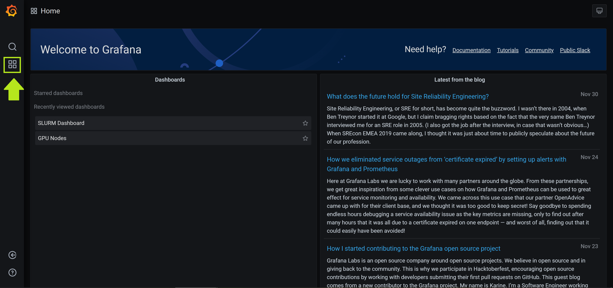
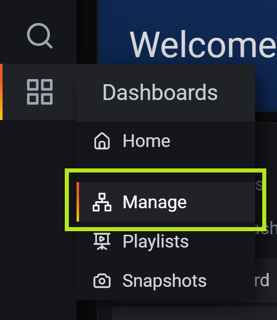
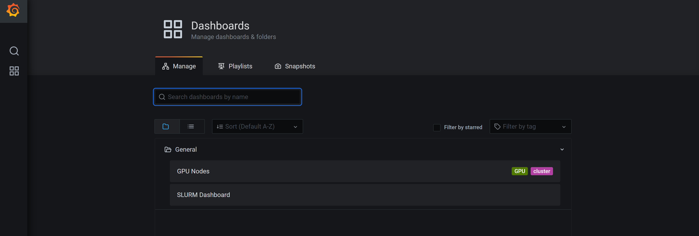
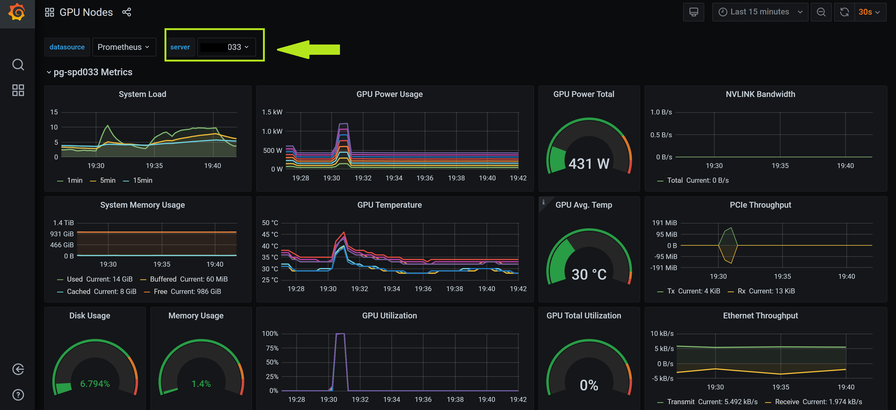
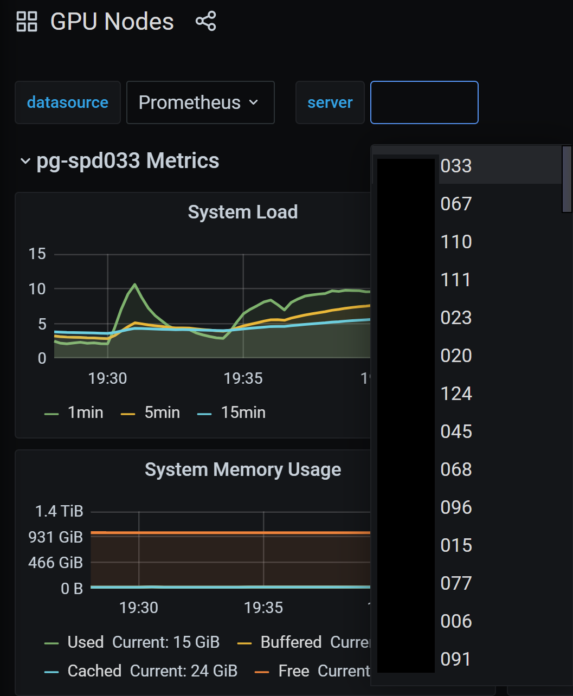
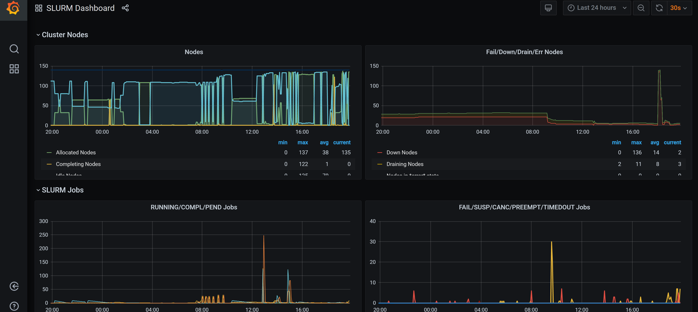
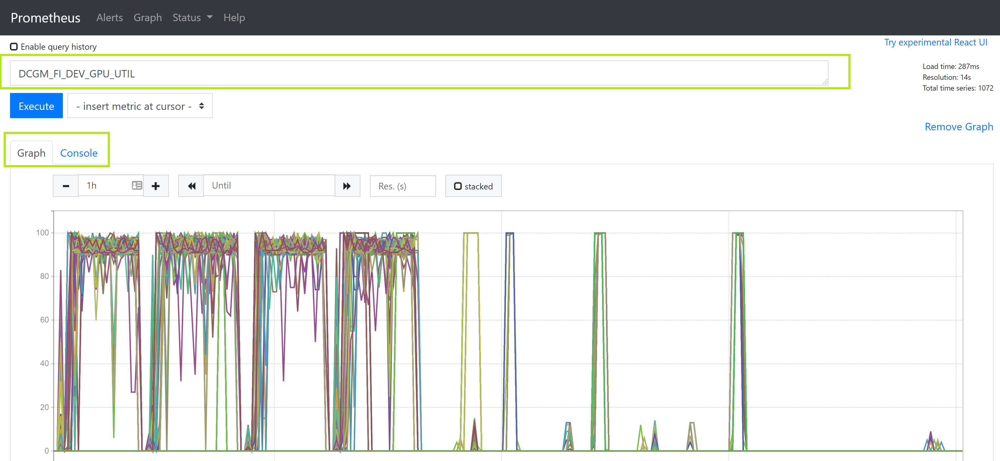

# Slurm Monitor

- [Slurm Monitor](#slurm-monitor)
  - [Introduction](#introduction)
  - [Exporters](#exporters)
  - [Grafana](#grafana)
  - [Prometheus](#prometheus)

## Introduction

By default DeepOps deploys a monitoring stack alongside Slurm. This can be disabled by setting `slurm_enable_monitoring` to `false`.

DeepOps runs a `dcgm-exporter` container on all DGX nodes. This container exports various GPU utilization and metadata to a Prometheus database running on the `slurm-metric` nodes. The `slurm-metric` nodes also run a Grafana server that connects to the Prometheus database to visualize the data. Ad-hoc metric queries can be made against the Prometheus server, but monitoring is typically done through the dashboard on Grafana.

## Exporters

A `node-exporter` and `dcgm-exporter` should be running on every node listed under `slurm-node`:

```bash
# View the DCGM Exporter container on a DGX node
$ sudo docker ps
CONTAINER ID        IMAGE                              COMMAND                  CREATED             STATUS
PORTS                    NAMES
139fe402640f        quay.io/prometheus/node-exporter   "/bin/node_exporter …"   56 minutes ago      Up 56 minutes                                docker.node-exporter.service
0da9e3f1a7c8        nvidia/dcgm-exporter               "/usr/bin/dcgm-expor…"   56 minutes ago      Up 56 minutes       0.0.0.0:9400->9400/tcp   docker.dcgm-exporter.service
```

## Grafana

The default configuration of Grafana comes with two dashboards. There is a dashboard to monitor Slurm usage and jobs and another GPU dashboard to monitor GPU utilization, power, etc.

In order to gain access to Grafana visit the url at http://\<slurm-metric ip\>:3000/. Once the web page loads, the dashboards can be accessed by clicking the dashboards icon on the left and selecting manage. This will bring you to a page listing all available dashboards. Click on a dashboard’s name to view it.







The GPU dashboard provides the following metrics:

- System Load
- GPU Power Usage (by GPU)
- GPU Power Total
- System Memory Usage
- GPU Temperature (by GPU)
- GPU Average Temperature
- PCIe Throughput
- Disk Usage
- GPU Memory Usage
- GPU Utilization (by GPU)
- GPU Total Utilization
- Ethernet Throughput
- Disk Throughput
- GPU Mem Copy Utilization
- GPU Average Memory Copy Utilization
- Kernel
- Hostname
- System Total Power Draw
- GPU SM Clocks
- GPU Memory Clocks

Metrics are displayed per-node. To view utilization across nodes click the server selection drop-down in the top left and type or select the desired node names.





The Slurm dashboard provides the following information about running jobs and the Slurm job queue:

- Nodes & Node Status
- Slurm Jobs & Job State
- Slurm Agent Queue Size
- Scheduler Threads & Backfill Depth Mean & Cycles



Grafana allows you to view custom time-slices, set the polling duration, and many other dashboard customizations.

For more information on creating custom dashboards and the available GPU metrics provided by Prometheus refer to the GPU Monitoring Tools [Readme](https://github.com/NVIDIA/gpu-monitoring-tools) or [Grafana home page](https://grafana.com/).

## Prometheus

In order to make ad-hoc queries Prometheus can be used. Visit Prometheus at http://\<slurm-metric ip\>:9090/graph and select one or more metrics in the drop down. Metrics can be visualized using the Graph button, or the text output can be shown by selecting the Console button. Advanced queries can be constructed using the Prometheus syntax. After constructing a query click the execute button and inspect the results.



For more information on constructing Prometheus queries see the official [Prometheus getting started guide](https://prometheus.io/docs/prometheus/latest/querying/basics/).
